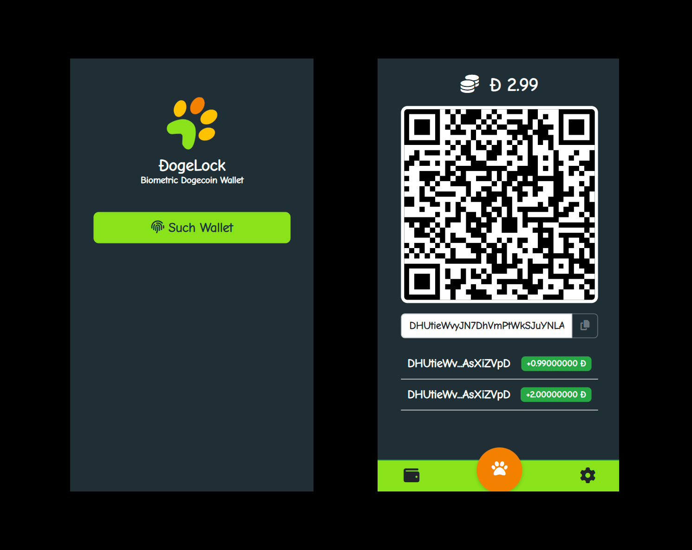

<h1 align="center">
Secure Biometric Dogecoin Wallet
<br><br>

<br><br>
</h1>

## How to Use? 💻

1- Get an Hosting Account or Web Server or even a Github account that you can host it

2- Upload the ```wallet/biometric.html``` to the host/server

3- Go to your browser and acess to it. 

###Notes:
- This is a proof of concept that is possible to generate secure Dogecoin Wallets using Biometrics and store it using Webauthn as credentials
- If you find any bug please report it.
